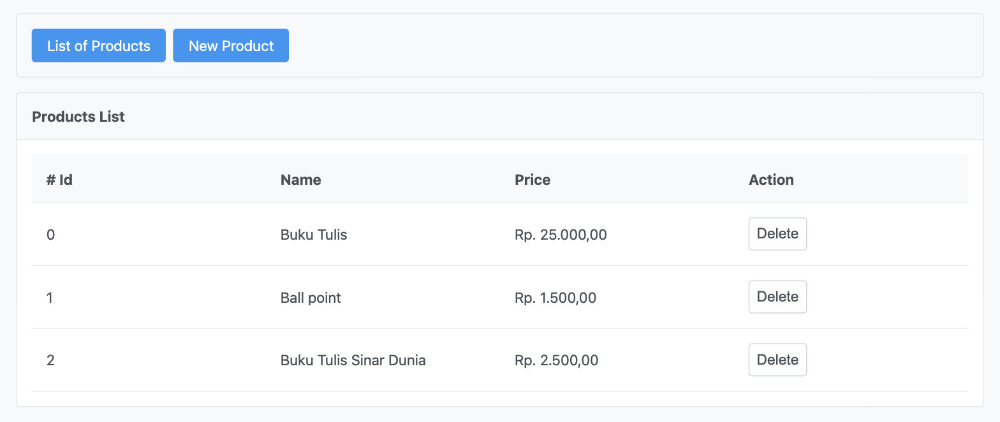
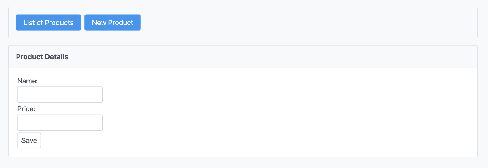

## JavaServer Faces with Spring Boot

A small CRUD sample built on Spring Boot 4, Jakarta Faces 4 (Apache MyFaces),
PrimeFaces and Rewrite/PrettyFaces, backed by HSQLDB with Flyway migrations.

### Requirements

* JDK 25
* Maven 3.9+

### Running

`mvn clean spring-boot:run`

The application is served on <http://localhost:8080/>. The schema and the demo
products are created by the Flyway migrations on first start, into an HSQLDB
file database under `data/`; delete that directory to start from scratch.

Run it with `spring-boot:run` rather than from the packaged jar: Rewrite
discovers the `@Join` mappings by scanning `WEB-INF/classes`, so the build
writes its output into `src/main/webapp` and the Facelets views are served from
that exploded directory.

#### Screenshot

List Products Page

Add New Product

